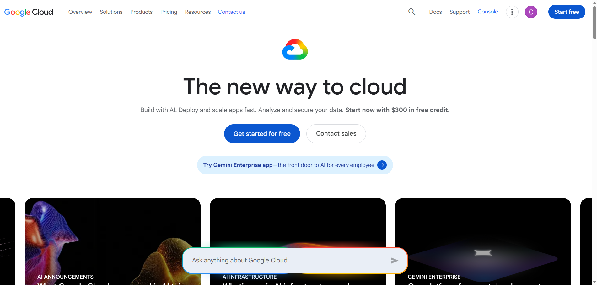

# Google Cloud Platform Research

## Brief Overview

Google Cloud Platform (GCP) is a cloud computing platform that provides services for computing, storage, networking, databases, analytics, artificial intelligence, and application development.

## Global Infrastructure

Google Cloud uses a global infrastructure organized into regions and zones. This allows applications and services to be deployed in different geographic locations while supporting availability and performance.

## Cloud Management Console

The Google Cloud Console is a web-based interface used to create, configure, monitor, and manage Google Cloud resources.

## Four Core Services

### 1. Compute Engine

Compute Engine provides virtual machines that can run Linux and Windows workloads in Google Cloud.

### 2. Cloud Storage

Cloud Storage provides object storage for files, backups, media, and application data.

### 3. Google Cloud VPC

Google Cloud VPC provides networking resources that allow organizations to control communication between cloud resources.

### 4. Cloud IAM

Cloud Identity and Access Management controls which users and services can access Google Cloud resources and what actions they can perform.

## Three Advantages

1. GCP provides strong capabilities for artificial intelligence and data analytics.
2. GCP provides scalable cloud infrastructure.
3. GCP provides strong support for containers and Kubernetes.

## Typical Enterprise Use Cases

GCP can be used for artificial intelligence, machine learning, data analytics, containerized applications, web applications, and large-scale data processing.

## Screenshot

